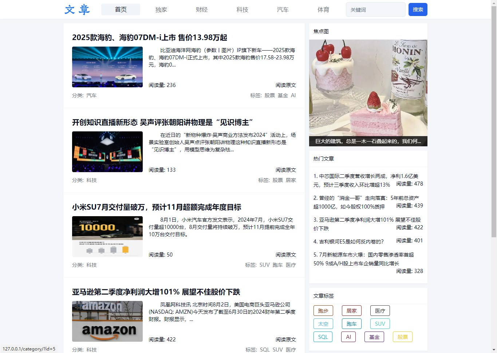
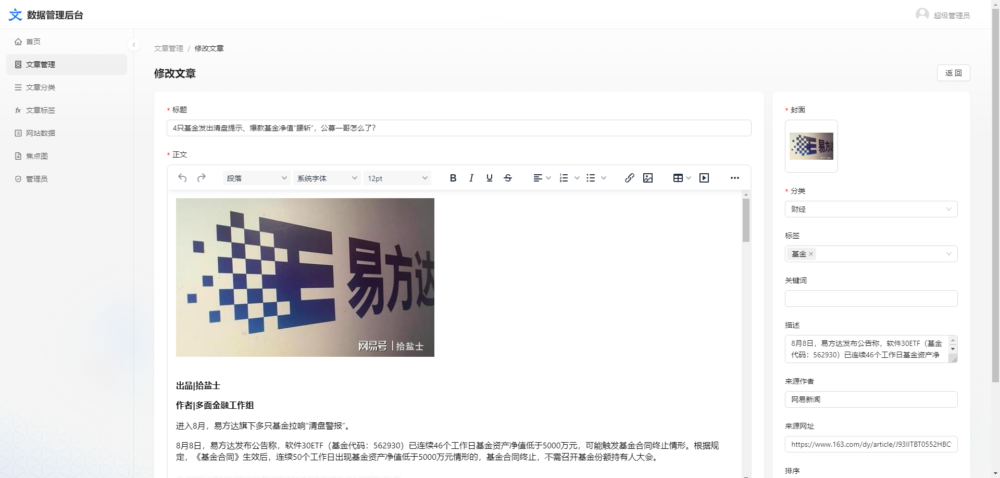
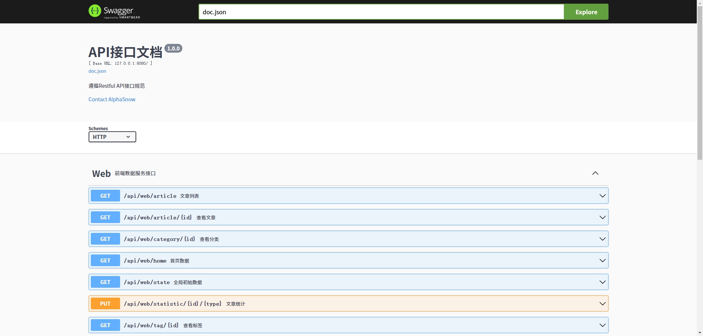

# 绿色内容管理系统
基于Golang 与 React 搭建的无依赖快速启动的内容管理系统.

## 预览
### 前台
电脑端  

手机端  

### 后台  
文章列表  

文章编辑  

### 接口
接口文档  

## 使用
### 直接使用
- 在发行版本页面
- 下载 `GreenCMS_windows_x64.zip`
- 解压并双击`main.exe`启动程序

### 二次开发
- init.bat 初始化项目, 下载前端后端依赖
- run.bat 开发模式运行项目
- build.bat 编译项目

## 目录
- admin/ 后台界面源码 
- build/ 可执行编译文件
- server/ 后端服务源码
- web/ 前台界面源码

## 技术栈
- server
    - golang
    - gin
    - sqlite
    - swaggo
    - gorm
    - casbin
    - gocache
    - zap
    - wire
- admin 
    - react18
    - antd5
    - umi
    - ahooks
    - tinymce
- web
    - nextjs14
    - zustand
    - tailwind
    - radix-ui

## 参考
> https://gin-gonic.com/docs/quickstart/  
> https://nextjs.org/docs/getting-started/installation  
> https://github.com/evrone/go-clean-template  

## 开源协议
[BSD 3-Clause License](LICENSE)