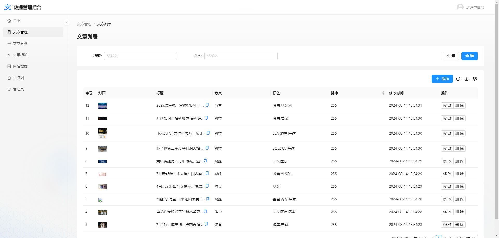

# 绿色内容管理系统
使用gin,sqlite,nextjs,antd搭建的无依赖快速启动的内容管理系统.

## 预览
### 前台
电脑端

手机端

### 后台
文章列表

文章编辑

### 接口
接口文档

## 使用
- init.bat 初始化项目, 下载前端后端依赖
- run.bat 开发模式运行项目
- build.bat 编译项目

## 目录
- admin/ 后台界面源码 
- build/ 可执行编译文件
- server/ 后端服务源码
- web/ 前台界面源码

## 技术栈
- server
    - golang
    - gin
    - sqlite
    - swaggo
    - gorm
    - casbin
    - gocache
    - zap
    - wire
- admin 
    - react18
    - antd5
    - umi
    - ahooks
    - tinymce
- web
    - nextjs14
    - zustand
    - tailwind
    - radix-ui

## 参考
> https://gin-gonic.com/docs/quickstart/
> https://nextjs.org/docs/getting-started/installation
> https://github.com/evrone/go-clean-template